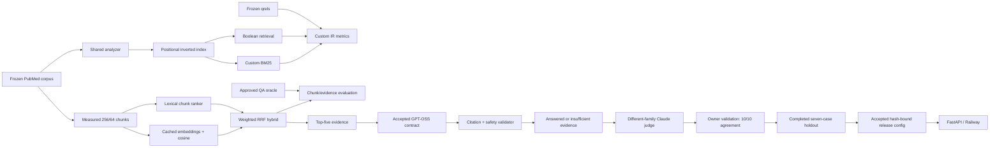

# Peptide-RAG Architecture

## Day 1 objective

The MVP is a measured lexical search baseline over PubMed title and abstract text. The required order is judgment set first, then a from-scratch positional inverted index, Boolean retrieval, and a deliberately red precision/recall harness. BM25 and RAG are later checkpoints, not Day 1 shortcuts.

The production index and metrics code may use the Python standard library, but no pre-built information-retrieval or metrics implementation (including PyTerrier, Elasticsearch, `rank_bm25`, or scikit-learn metrics).

## System overview



The lower path is active in the public application because development
selection, blind human judge validation, and the untouched holdout passed. The
accepted generator is `openai/gpt-oss-20b`; the different-family judge is
`anthropic/claude-sonnet-4.6`.

## Frozen corpus input

The Day 1 corpus contains 2,000 unique PubMed records in `data/corpus.jsonl`. All records have a PMID and title; 81 have no abstract and remain valid title-only documents. Its SHA-256 is `231E048971C34EF9203ED3BB20587DDE4C95141AC7EFD2746C85C078A844212C`. Qrels version 1 must name this exact hash so later corpus refreshes cannot silently change the evaluation population.

## Analysis pipeline

Corpus text is stored with its original case. Index and query analysis use one shared function with these exact steps:

1. Normalize the input with Unicode NFKC.
2. Apply `str.casefold()`.
3. Extract maximal Unicode alphanumeric runs. Every punctuation character, symbol, hyphen, and underscore is a boundary.
4. Keep tokens in source order and retain duplicates.

Examples:

| Input | Tokens |
|---|---|
| `BPC-157 healing` | `bpc`, `157`, `healing` |
| `GHK-Cu` | `ghk`, `cu` |
| `MOTS-c–related` | `mots`, `c`, `related` |

The baseline does not stem and does not remove stopwords. Those choices preserve medical names, abbreviations, and positions while providing an intentionally simple baseline. Any later change to analysis must run against the same versioned qrels and be retained only when the recorded metrics improve without breaking robustness tests.

For indexing, analyze `title + " " + text` as a single token stream. Positions are zero-based across that combined stream; the abstract continues immediately after the final title token. Empty titles or abstracts contribute no tokens.

## In-memory index

The implementation will use frozen postings so search cannot accidentally mutate index state:

```python
from dataclasses import dataclass

@dataclass(frozen=True)
class Posting:
    doc_id: str                 # PMID
    positions: tuple[int, ...]  # sorted, zero-based positions

InvertedIndex = dict[str, tuple[Posting, ...]]
DocumentFrequency = dict[str, int]
Documents = dict[str, dict[str, str]]
DocumentLengths = dict[str, int]
```

The built index owns four structures:

- `postings: InvertedIndex`: term to immutable postings ordered by numeric PMID; each document appears once per term.
- `document_frequency: DocumentFrequency`: term to `len(postings[term])`, stored explicitly for later BM25 IDF.
- `documents: Documents`: PMID to the exact `{"id", "title", "text"}` corpus record used for result display.
- `document_lengths: DocumentLengths`: PMID to analyzed token count for later BM25 length normalization.

During construction, mutable dictionaries and position lists may be used. The finalized index converts every position list and posting list to tuples and validates that positions increase strictly, PMIDs are unique within each posting list, and `document_frequency[term]` equals the posting count. Numeric PMID ordering means `"9"` precedes `"10"`.

## Day 1 Boolean query contract

Operators are recognized case-insensitively only when a whitespace-delimited token is exactly `AND` or `OR`. `AND` has higher precedence than `OR`; adjacent terms have an implicit `AND`. Therefore `bpc healing OR tendon` means `(bpc AND healing) OR tendon`.

Each analyzed query term resolves to its posting-set of PMIDs. `AND` intersects sets and `OR` unions them. Returned PMIDs are deduplicated and sorted numerically for deterministic results. Day 1 does not support `NOT`, parentheses, quoted phrases, proximity syntax, or ranking. Empty, operator-only, punctuation-only, and out-of-vocabulary queries return an empty result rather than raising an exception.

## Judgment-set protocol

Labels are created before using this engine to search. This prevents the implementation's own rankings from selecting its evaluation examples.

1. Freeze the downloaded `data/corpus.jsonl` snapshot and record its hash in the qrels review notes.
2. Assign each document to every peptide family whose normalized alias occurs in its title: BPC-157, GHK-Cu, TB-500/Thymosin Beta-4, Ipamorelin, Tesamorelin, Epitalon, MOTS-c, or PT-141. Exclude documents with no title or no abstract.
3. Walk the peptide families in the query's declared order. For each family, choose the lowest numeric PMID not already selected; repeat round-robin until 15 documents are selected. If a family is exhausted, skip it. If fewer than 15 title matches exist, fill the remainder with the lowest numeric eligible PMIDs.
4. Without running the search engine, read each selected title and abstract and write one natural information need a researcher might ask. Do not copy the paper title or paste a distinctive sentence.
5. Give the source PMID an initial positive grade and manually review the corpus for obvious additional relevant documents using PubMed metadata or simple non-engine text filtering. Record every reviewed judgment and a short rationale.
6. Freeze the first 15 queries as qrels version 1 before measuring retrieval.

This is a provisional known-item set, not exhaustive relevance pooling. The selected source PMID guarantees at least one positive judgment per query, but unjudged relevant papers may be retrieved and counted as non-relevant, depressing measured precision. The README must disclose that limitation beside reported results.

### Pooled judgment-set strengthening

After recording the untouched Day 1 baseline, strengthen the oracle without changing retrieval behavior:

1. Run `scripts/prepare_qrels_pool.py` against the frozen corpus and approved version-1 qrels.
2. For each query, preserve every existing judgment, add strict Boolean matches in numeric PMID order, then fill a five-document pool by descending distinct query-term coverage and numeric PMID as the tie-breaker.
3. Treat this procedure only as candidate discovery. It must never assign relevance automatically. Its Boolean/term-overlap bias is disclosed because the pool does not represent every potentially relevant corpus document.
4. A human reads every pooled title and abstract and assigns exactly one grade: `2` directly relevant, `1` partially relevant, or `0` not relevant, with a topical reason. Literal term overlap alone is not relevance.
5. Reconfirm old judgments, record all new positive and negative judgments, increment the qrels version, retain the same corpus hash, and rerun the unchanged retrieval and metrics code.

The version-1 metrics remain historical baseline evidence. Version-2 results must be reported separately rather than replacing the earlier numbers, so judgment expansion cannot be mistaken for a retrieval improvement.

`data/qrels.json` will use this versioned shape:

```json
{
  "version": 1,
  "corpus_sha256": "<sha256 of data/corpus.jsonl>",
  "queries": [
    {
      "id": "q01",
      "query": "<human-written information need>",
      "judgments": {"12345678": 2, "23456789": 1, "34567890": 0},
      "rationale": "<manual explanation of the labels>"
    }
  ]
}
```

Judgment keys are PMIDs and values are integer grades. For Day 1 binary precision and recall, grades greater than zero are relevant and grade zero is non-relevant. Numeric grades are retained so the same file can later support NDCG.

## Execution sequence

1. Fetch and freeze the corpus.
2. Construct and freeze the 15-query qrels without engine-assisted selection.
3. Build and validate the positional inverted index.
4. Implement deterministic Boolean retrieval.
5. Run the precision@k/recall@k harness, expect failures or weak scores initially, and record the output before tuning.
6. Pool and manually label additional query-document pairs, freeze qrels version 2, and report its metrics separately.

## Section 3: ranked lexical retrieval

BM25 is now the default ranked-search mode; Boolean retrieval remains an exact
filter and historical baseline. The production scorer uses the existing
postings, document frequencies, and combined title-plus-abstract document
lengths. It does not import a ranking library.

The baseline is the Lucene BM25 variant:

```text
idf(t) = ln(1 + (N - df(t) + 0.5) / (df(t) + 0.5))

tf_component(t,d) = tf(t,d) /
    (tf(t,d) + k1 * (1 - b + b * document_length / average_document_length))

score(q,d) = sum(idf(t) * tf_component(t,d))
```

`k1=1.2` and `b=0.75` are untouched defaults. Each occurrence of a repeated
query token contributes separately. Candidate generation unions the postings
for all in-vocabulary terms; documents with no match receive no result. Results
sort by descending score and numeric PMID. `BM25Config` and `ScoredDocument`
are frozen dataclasses, and invalid parameters fail before scoring.

The full metrics harness treats grades above zero as relevant for binary
precision, recall, and reciprocal rank. Graded NDCG uses gain `2^grade - 1`
and discount `log2(rank + 1)`. Aggregate metrics are macro means. The evaluator
saves rankings, per-query results, aggregates, environment details, and input
hashes as JSON, then renders Markdown from the same report object.

`bm25s==0.3.9` is allowed only in the development test environment. Its Lucene
variant receives the exact same analyzed token arrays; all positive scores are
compared within `1e-6`, and ties are normalized by numeric PMID. Production
imports remain dependency-free.

Before BM25 results were measured, `data/eval_split.json` froze development
queries `q01`–`q08`, `q12`, and `q14`, with `q09`, `q10`, `q11`, `q13`, and
`q15` reserved as the Section 4 holdout. Baseline reporting may describe all
15 queries, but no tuning decision may use holdout results.

## Section 4: measured lexical tuning

Section 4 evaluated 16 `k1`/`b` pairs on development queries only, followed by
four pre-registered analyzers and four proximity boosts. Selection was ordered
by NDCG@10, Recall@10, MRR, simplicity, distance from the untouched default,
and numeric order. `data/lexical_config.json` hash-freezes the resulting
development artifact before holdout access.

The selected configuration keeps the baseline analyzer and uses `k1=0.8`,
`b=0.75`, and `proximity_boost=0.0`. Greek expansion tied the baseline and was
rejected for unnecessary complexity. The fixed stopword list and every tested
positive proximity boost reduced development quality and were rejected.

Alternative analyzers are immutable named configurations stored with each
index. Index construction and query analysis must use the same configuration.
The index now stores analyzed title lengths so proximity checks cannot cross
the title/abstract boundary. Experimental proximity considers adjacent query
token pairs in order, allows gaps from one to three, contributes at most one
bonus per pair/document, and scales the bonus inversely with the gap.

`without_document(doc_id)` returns a newly rebuilt index under the same
analyzer. The original index is not mutated. Property tests cover IDF
monotonicity, matching-term advantage, diminishing term-frequency gains,
determinism, Unicode normalization, long inputs, deletion, and index integrity.

The holdout script refuses existing outputs and validates the corpus, qrels,
split, development experiment, and frozen configuration hashes. The first
invocation reached evaluation but failed before exposing results due to a
lowercase JSON Boolean in Python; the frozen configuration was not changed,
and the corrected invocation is disclosed as a technical rerun.

## Section 5: measured RAG extension

RAG selection begins with a separate 20-question oracle, not with a chunk-size
guess. `data/qa.json` contains 15 answerable and five intentionally unanswerable
owner-approved cases. `scripts/freeze_qa.py` required an explicit approve
decision and named reviewer for every case, revalidated every abstract offset
and span hash against the frozen corpus, and normalized the approved file to
this public shape:

```json
{
  "version": 1,
  "corpus_sha256": "<frozen corpus>",
  "questions": [{
    "id": "qa01",
    "question": "<human information need>",
    "answerable": true,
    "acceptable_answer": "<bounded answer>",
    "relevant_pmids": ["12345678"],
    "supporting_spans": [{
      "pmid": "12345678",
      "start_char": 0,
      "end_char": 120,
      "text_sha256": "<exact abstract substring hash>"
    }],
    "rationale": "<manual rationale>",
    "split": "development",
    "human_review": {"approved": true, "decision": "approve", "reviewer": "<owner>"}
  }]
}
```

The fixed split is 10 answerable plus three unanswerable development cases and
five answerable plus two unanswerable holdout cases. Holdout was unavailable to
chunk, fusion, or generator selection and remains excluded from those choices.

Chunking uses exact abstract-relative character offsets and deterministic
whitespace-word windows: 128/32, 256/64, and 512/128 words/overlap. Titles are
prepended only to retrieval and embedding input. Title-only records receive an
empty, non-evidence chunk so they remain lexically searchable without creating
answer support. Each JSONL snapshot has a corpus-bound manifest and stable
`{PMID}:cNNNN` identifiers.

`scripts/evaluate_chunks.py` evaluates all three snapshots on the 10 approved
answerable development cases. It reports lexical and semantic Recall@1/3/5/10
and Evidence Hit@k. Selection maximizes the lower of lexical and semantic
Recall@5, then their mean, then fewer average context tokens. Weighted RRF uses
50 candidates per source and `alpha/(60+lexical_rank) +
(1-alpha)/(60+semantic_rank)` for alpha values 0.25, 0.5, and 0.75. It selects
by hybrid Recall@5, Evidence Hit@5, then proximity to alpha 0.5. The selected
configuration, exact system prompt, generation settings, embedding model, QA
hash, and source-evaluation hash are frozen together before the bake-off.

The measured development winner is 256-word windows with 64-word overlap.
Lexical and semantic Recall@5 both measured `0.710`; the selected `alpha=0.5`
hybrid raised Recall@5 to `0.810` and Evidence Hit@5 to `0.900`. The 512-word
candidate had slightly higher lexical Recall@5 (`0.717`) but lower semantic
Recall@5 (`0.667`), so it lost under the preregistered max-min rule.

Embeddings use an OpenRouter-hosted model only after explicit credentials are
provided. Corpus inputs are embedded once, normalized, and saved in an atomic
NumPy cache containing model, dimension, corpus/chunk/input hashes, timestamp,
and chunk order. All 13 development-question vectors are also stored in a
QA/corpus/model-bound cache with hash-bound provider-usage metadata. First-run
evaluation reloads this saved cache before scoring, making cache-only replays
byte-identical. Query vectors and cached document vectors use brute-force cosine
similarity. Production retrieval and RRF are hand-built; there is no vector
database or semantic retrieval library.

Grounded generation sends at most five numbered chunks at temperature zero. The
original bake-off used a 400-token cap and declared citation IDs. Measured
failures led to a versioned 800-token GPT diagnostic with citation identities
derived locally from visible `[n]` markers and low reasoning effort; the QA,
retrieved contexts, and holdout did not change. Structured output must either be
`answered` with markers bound to supplied chunks or `insufficient_evidence`
with no citations. Every substantive factual sentence needs a citation marker.
Unknown IDs, uncited sentences, malformed output, missing evidence, and
provider failures fail closed. One secondary attempt is permitted: invalid
output receives a structural repair, while an initially valid refusal can use
that same single budget for a general recheck of all five passages. The two
paths cannot both execute for one case. Personalized or prescriptive dosing
requests are rejected deterministically before a provider call; questions
about doses reported in a named study remain research queries.

The public API does not collapse every refusal into “insufficient evidence.” It
maps private generation metadata to four fixed, non-sensitive categories:
`medical_safety`, `insufficient_evidence`, `service_unavailable`, and
`budget_limit`. The UI labels the category, shows its approved explanation, and
keeps the retrieved passages visible. Raw provider errors and validation codes
remain server-side.

The historical three-model development bake-off required identical stored
contexts and hashes. After Qwen/Gemma provider failures and insufficient GPT
answer coverage, the project owner selected GPT-OSS as the sole continuing
generator while retaining all losing artifacts. A structurally invalid or
incompletely judged model is disqualified
before selection by faithfulness, refusal correctness, relevancy, citation
correctness, actual provider-reported cost when available, and p95 latency.
Every reported rate includes its denominator, all expected outputs must have
complete judge verdicts, and a model that answers no cases receives citation
correctness zero rather than an undefined score that removes it from the
comparison. Reports separately expose answerable answer rate, correct-answer
rate, correct-refusal rate, and overall answerability classification. A
development winner is provisional and is not itself an acceptance gate. Claude is the
different-family judge, but its verdict is unusable until a deterministic
10-output sample reaches at least 80% owner agreement and Cohen's kappa 0.60.
When kappa is undefined because one side has no label variation, at least 80%
raw agreement plus the confusion matrix is the disclosed fallback rather than
an impossible gate. The owner worksheet hides the judge verdict, oracle
acceptable answer, and frozen answerability target, but displays the frozen
question, returned answer, and exact five retrieved chunks required to make
independent labels. Samples use deterministic hash-mixed order and opaque review
IDs so position and raw QA identifiers do not reveal the target. Both validation
paths require exact one-time coverage of the frozen ten-case sample and exact
root/nested field allowlists. The IDs provide procedural, not cryptographic,
blinding because their deterministic construction is public; the owner must use
only the rendered review packet until labels are frozen. Citation
correctness may be marked not applicable for a refusal with no citations, and
the smaller denominator is reported. During validation the worksheet is
SHA-256-bound to the QA, contexts, and saved outputs; all displayed evidence is
reconstructed and tamper-checked, and the judge verdict is reloaded rather than
trusted from the human-editable worksheet. Answerability never enters the LLM
judge prompt; refusal correctness is calculated deterministically from the
frozen QA label and returned answer status.

The current judge-only runner cannot regenerate an answer or retrieve a new
context. It opens only when the bound GPT development artifact measures 10/10
answerable answers, 3/3 correct system refusals, and 13/13 structurally valid
outputs. It then makes exactly 13 different-family Claude judge calls. For the
single-generator run, the deterministic human worksheet contains seven
answerable outputs and all three unique unanswerable outputs. A separate cost
estimate and owner approval are required before judging.

The first development bake-off is a retained negative result. Hybrid retrieval
placed a full labeled support span in the top five for nine of ten answerable
cases, but Qwen and GPT-OSS answered zero and Gemma answered two. The corrected
offline report still identifies Gemma under the pre-registered lexicographic
ordering, while explicitly marking it provisional and showing a correct-answer
rate of `0.200`. No holdout case is exposed until the owner judge-validation
gate passes and any generator revision is versioned rather than silently
changing the post-result selection rule.

Later GPT-only generator evidence is also preserved: v2.2 measured 8/10
answerable cases and 2/3 correct refusals; v2.3 measured 9/10, 3/3, and 13/13
structural validity. The final v2.3 miss was a refusal despite direct human
evidence at context rank 5, so v2.4 tests a general refusal-reconsideration
stage. It contains no QA ID, expected answer, PMID, or question-specific hint.
The measured run reached 10/10 answerable cases, 3/3 correct refusals, and
13/13 structurally valid outputs. QA04 was answered after reconsideration from
the unchanged rank-five evidence, so the improvement is attributed to the
answer-synthesis policy rather than retrieval or chunk changes. Its first
Claude judge measured `0.800` answered-only faithfulness and exposed unsupported
scope generalizations in qa02 and qa07. A versioned general prompt correction
in v2.5 kept the generation gate perfect without changing QA, retrieval,
contexts, model, or holdout. The corrected judge-v2 contract extracts claims
only from the answer, validates exact scope and polarity, requires a hashed raw
response, and replays copied and combined metadata. Its measured v2.5 result is
`0.900` answered-only faithfulness, `1.000` relevancy, `0.900` citation
correctness, and `1.000` correct refusal. The remaining qa08 failure is retained
as over-citation evidence. Owner validation subsequently reached 10/10 agreement
with the Claude judge; kappa is undefined because neither label series varied,
so the documented raw-agreement fallback applies.

The holdout bridge remains deliberately separate from generator tuning. Its
hash-bound selection used the exact v2.5 generator, judge-v2, blind worksheet,
and passing owner-agreement hashes. The completed one-shot holdout passed 7/7
structural and judged outputs, 5/5 answerable responses, and 2/2 correct
refusals. Faithfulness, relevancy, citation correctness, correct answer, and
correct refusal all measured 1.0; p95 latency was 8445.535 ms and actual cost
was `$0.06478416`. Saved rows retain exact QA/provenance identities,
citation-bound answers, judge verdicts, raw-response hashes, and recomputable
usage metadata. No post-holdout tuning occurred.

Public smoke then exposed a valid-refusal edge case: failure of optional
reconsideration could discard a safe validated refusal. PR #8 retains the safe
refusal and records the failed reconsideration. It changes neither prompts,
retrieval, nor the untouched holdout.

## Application and release boundary

The single-process FastAPI service exposes `/healthz`, `/api/metrics`,
`/api/search`, and `/api/answer`. Local Boolean and frozen tuned-BM25 search
work without a provider. Semantic/hybrid retrieval activates only when the
configured cache matches the selected chunk, corpus, and model identities.
Without it, explicit semantic/hybrid requests return no fabricated semantic
result. When a configured provider is saturated or the daily query-embedding
budget is exhausted, the API makes a visible BM25 fallback and reports both the
requested and actual mode plus the reason.

Grounded generation has a second, independent activation gate. The service
requires the final passing-holdout status, the exact accepted-selection hash,
the frozen retriever hash, the source v2.5 generator-config hash, the prompt
hash, every recorded generation setting, and the exact saved holdout contexts,
outputs, and passing summary hashes to agree. It then constructs the client
with those measured settings; it never falls back to the library's default
prompt or token cap. Missing or altered evidence leaves generation disabled
while local retrieval remains available.

The browser renders corpus and model strings with text nodes, converts only
the service's `[[query match]]` markers to safe `<mark>` elements, and creates
PubMed citation links itself. Queries are capped at 500 characters, `k` at
1--20 for search and 1--8 for Q&A, and the in-memory single-process limits are
30 search requests and five answer requests per IP per minute plus 200 answer
attempts and 5,000 query embeddings per UTC day by default. Keys stay
server-side and raw query text is not logged. These counters are explicitly
single-instance controls, not a distributed rate-limiting claim. Synchronous
index, embedding, and generation work runs in Starlette's thread pool, while a
configurable semaphore bounds concurrent provider work. Answer and embedding
slots are reserved before provider awaits, and an exhausted answer budget is
checked before semantic retrieval. Provider-client request metadata is
thread-local; production HTTP sessions are also per-thread, while explicitly
injected shared test sessions are serialized. This prevents repair or usage
state from crossing requests without negating the provider-concurrency limit.

`python run_project.py` is the network-free release check. It validates the
frozen lexical state, rebuilds the index, recomputes Boolean/BM25 metrics,
compares the complete per-query and aggregate reports with saved evidence, and
validates committed chunk manifests. The approved QA, retrieval caches, and
first bake-off plus GPT v2.2/v2.3/v2.4/v2.5 diagnostics and the v2.4/v2.5 judge
runs are saved evidence. The runner replays their outputs, metrics, usage,
cost-estimate bounds, worksheets, and frozen hashes. The final offline run
passes every gate. The accepted generator is `openai/gpt-oss-20b`, the judge is
`anthropic/claude-sonnet-4.6`, and the public deployment is
[peptide-rag-production.up.railway.app](https://peptide-rag-production.up.railway.app),
from main commit `4c709558dd0796a416022eeebf7436259927e0de` (Railway deployment
`37dcb82b-a1cd-4524-ae52-ecc5481c34c3`, `SUCCESS`). Public smoke passed health,
metrics, same-origin behavior, BM25, a grounded two-citation answer, a
model-originated `qa17` refusal, and controlled rate limiting (HTTP 429 exactly
at probe 30). A short, timestamped Railway billing and resource snapshot is
saved in `artifacts/section6/railway_release_measurement.json`; it is operational
evidence, not a monthly forecast or a capacity test. Historical
development-machine memory measurements remain separate sizing evidence.
