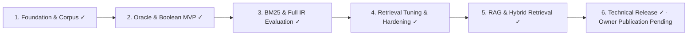

# Peptide-RAG Project Master Plan

This roadmap tracks Peptide-RAG from corpus construction through a measured public release in six sections. Sections 1–5 and the Section 6 technical release gates are complete; demo recording and social publication remain optional owner actions. The detailed contracts and retained negative results remain below.



## Current state

| Section | Status |
|---|---|
| 1. Foundation and corpus | Complete |
| 2. Oracle and Boolean MVP | Complete |
| 3. BM25 and full IR evaluation | Complete |
| 4. Retrieval tuning and hardening | Complete |
| 5. RAG and hybrid retrieval | Complete: accepted `openai/gpt-oss-20b` with `anthropic/claude-sonnet-4.6`; blind owner validation was 10/10 agreement and the untouched holdout passed all gates |
| 6. Final evaluation and release | Technical release gates complete: deployed CI run `32071964692` and `run_project.py` pass, Railway deployment `37dcb82b-a1cd-4524-ae52-ecc5481c34c3` is `SUCCESS`, and a timestamped Railway usage snapshot is saved; demo recording and social posting remain optional owner actions |

The frozen corpus contains 2,000 PubMed records and has SHA-256 `231E048971C34EF9203ED3BB20587DDE4C95141AC7EFD2746C85C078A844212C`. The frozen qrels v2 contains 75 graded judgments across 15 queries. Neither artifact may be silently changed.

## Working rules

- Measure every change against a versioned oracle; never select a feature because it merely looks better.
- Keep the production index, BM25, fusion, and metrics implementations free of prebuilt IR or metrics libraries.
- Permit a reference BM25 library only in isolated differential tests.
- Preserve raw JSON experiment output and generate Markdown from it.
- Record corpus, qrels, configuration, code, and prompt hashes with every experiment.
- Keep unsuccessful experiments and negative results.
- Use lower-cost coding agents for bounded modules, while the primary agent owns interfaces, evaluation design, integration, and release decisions.
- Treat Claude Code as an independent reviewer, not an oracle and not the approver of its own suggestions.
- Complete, test, document, commit, and publish each section before beginning the next.

## 1. Project Foundation and Corpus — Complete

- Project scope, early design exploration, and architecture documented.
- PubMed fetch pipeline implemented and tested.
- 2,000-document corpus downloaded, validated, and frozen.
- Shared NFKC/casefold/Unicode-alphanumeric analysis pipeline established.
- Clean-clone setup and NCBI attribution documented.

Completion gate: a reproducible, validated corpus and documented architecture exist.

## 2. Evaluation Oracle and Boolean MVP — Complete

- Fifteen natural research queries created.
- Provisional qrels v1 preserved.
- Qrels v2 strengthened to 75 graded judgments: 40 grade-2, 25 grade-1, and 10 grade-0.
- Positional inverted index and deterministic Boolean `AND`/`OR` retrieval implemented.
- Precision@k and recall@k implemented from scratch.
- Versioned baseline metrics and 63 tests recorded.

Completion gate: retrieval failures can be measured objectively.

# 3. BM25 Ranked Retrieval and Full IR Evaluation

## 3.1 Frozen evaluation protocol

Before inspecting BM25 results, create a versioned split:

- Development: `q01`–`q08`, `q12`, `q14`.
- Holdout: `q09`, `q10`, `q11`, `q13`, `q15`.

The full 15-query baseline may be reported, but only development queries may influence Section 4 tuning. Holdout is evaluated once after the final lexical configuration is frozen.

## 3.2 Exact BM25 contract

Implement Lucene-style BM25 over the existing positional index:

```text
idf(t) = ln(1 + (N - df(t) + 0.5) / (df(t) + 0.5))

tf_component(t,d) = tf(t,d) /
    (tf(t,d) + k1 * (1 - b + b * document_length / average_document_length))

score(q,d) = sum(idf(t) * tf_component(t,d) for every analyzed query-token occurrence)
```

Defaults and invariants:

- `k1=1.2`, `b=0.75`.
- The existing title-plus-abstract document length remains authoritative.
- Duplicate query terms contribute repeatedly.
- Candidate documents are the union of the postings for all in-vocabulary query terms.
- Zero-match documents are excluded.
- Results sort by descending score and then numeric PMID.
- Empty, punctuation-only, and all-OOV queries return no results.
- `k > 0`, `k1 > 0`, and `0 <= b <= 1` are enforced.

Public types and entry point:

```python
@dataclass(frozen=True)
class BM25Config:
    k1: float = 1.2
    b: float = 0.75

@dataclass(frozen=True)
class ScoredDocument:
    doc_id: str
    score: float

def rank_bm25(index, query, k=10, config=BM25Config()):
    """Return tuple[ScoredDocument, ...]."""
```

The Lucene reference variant intentionally omits a `(k1 + 1)` score multiplier so that absolute scores, not just rankings, match the selected reference implementation.

## 3.3 Full metrics harness

Extend the hand-built metrics harness with:

- Precision and recall at `1`, `3`, `5`, and `10` using grades greater than zero as relevant.
- MRR using the first positive judgment in the complete positive-score ranking.
- NDCG at `1`, `3`, `5`, and `10` using gain `2^grade - 1` and discount `log2(rank + 1)`.
- Deterministic per-query and macro aggregate JSON.
- Deterministic README-ready Markdown.
- Zero-safe handling of queries with no relevant documents.

Public evaluation entry point:

```python
evaluate_run(qrels, rankings, cutoffs=(1, 3, 5, 10)) -> EvaluationReport
```

## 3.4 Search experience

Support:

```bash
python search.py "BPC 157 tissue regeneration" --mode bm25 --top-k 10
python search.py "BPC 157 tissue regeneration" --mode boolean
python run_ir_eval.py --qrels data/qrels_v2.json --modes boolean,bm25
```

Each ranked result includes rank, PMID, stable score, title, query-aware snippet, and PubMed URL. Snippets choose the earliest 240-character window with the largest number of distinct query terms, add ellipses when truncated, highlight matches without modifying source text, and remain safe for later HTML rendering.

## 3.5 Differential and correctness tests

- Keep `bm25s` in development dependencies only.
- Compare identical tokenized documents and queries using `method="lucene"`, the same `k1`/`b`, and compatible precision.
- Compare every positive custom score within `1e-6`.
- Normalize ties by numeric PMID.
- Run the differential on hand-built corpora and all 15 frozen queries.
- Test hand-calculated IDF, term-frequency saturation, length normalization, duplicate terms, partial matching, stable ties, OOV input, snippets, MRR, and graded NDCG.

## 3.6 Completion gate

- Reference scores and rankings match within tolerance.
- All existing and new tests pass.
- Boolean and untouched BM25 baseline artifacts are saved.
- README claims follow the measured results.
- Claude's independent formula audit is resolved with code or test evidence.
- No embeddings, LLMs, or tuning enter this section.

# 4. Retrieval Tuning and Hardening

## 4.1 Baseline preservation

- Preserve the Section 3 BM25 configuration and all-query results.
- Prohibit qrels edits during tuning.
- Restrict all model selection to the 10 development queries.
- Do not inspect holdout results until the winning lexical configuration is frozen.

## 4.2 Parameter experiment

Run the full grid using the baseline analyzer:

- `k1`: `0.8`, `1.2`, `1.6`, `2.0`.
- `b`: `0.0`, `0.5`, `0.75`, `1.0`.

Choose deterministically by development macro NDCG@10, Recall@10, MRR, simplicity, distance from the baseline values, and finally numeric order. Preserve all 16 results.

## 4.3 Analyzer experiment

Using the winning parameter pair, test:

1. Existing baseline analyzer.
2. Baseline plus Greek-letter expansion for alpha, beta, gamma, and delta.
3. Baseline plus a fixed, versioned English stopword list.
4. Greek expansion plus the same stopword list.

Do not add stemming. Rebuild the full index for each analyzer, test stopword-only inputs, and retain a changed analyzer only if development metrics justify it.

## 4.4 Phrase/proximity experiment

- Track title token length so matching cannot cross the title/abstract boundary.
- Examine adjacent analyzed query-token pairs with ordered gaps of one to three.
- Give exact adjacency the largest bonus.
- Allow each pair to contribute once per document.
- Test boost values `0.0`, `0.1`, `0.25`, and `0.5`.
- Keep proximity separate from the reference BM25 differential.
- Retain it as the primary mode only if it wins by the same development criteria.

## 4.5 Holdout and robustness

After freezing the final lexical configuration:

- Run the five holdout queries exactly once.
- Compare untouched BM25 with the selected system.
- Publish holdout and full-set descriptive results without returning to tuning.

Property and robustness coverage:

- IDF decreases as document frequency increases.
- A matching query term cannot make an otherwise identical document rank below a non-matching document.
- Repeated term occurrences have positive, diminishing gains.
- Index/search round trips preserve every document.
- `without_document(doc_id)` returns a new valid index and removes all references to that PMID.
- Failed operations never partially mutate the source index.
- Empty, whitespace, punctuation, stopword-only, Unicode-composed/decomposed, OOV, repeated, and very long inputs never crash or corrupt the index.

## 4.6 Performance report

- Measure five cold index builds.
- Warm retrieval once.
- Run each frozen query 100 times.
- Report median and p95 build time, query time, and memory.
- Record measurements without inventing an unrequired pass threshold.

## 4.7 Completion gate

- Baseline, complete experiment grid, selected configuration, and untouched holdout result exist.
- Every retained feature points to a measured improvement.
- Property, deletion, integrity, and robustness tests pass.
- Benchmark and configuration artifacts are reproducible.
- Architecture and README document successful and rejected experiments.

# 5. RAG, Semantic Retrieval, and Public Application

## 5.1 QA oracle before RAG tuning

Create and owner-approve 20 cases before choosing chunks:

- 15 answerable research questions.
- 5 intentionally unanswerable questions.
- Answerable questions include an acceptable answer, relevant PMIDs, exact supporting abstract spans/offsets, span hashes, and rationale.
- Unanswerable questions contain no relevance or support entries and explain why the corpus lacks sufficient evidence.

Freeze 13 development cases (10 answerable, 3 unanswerable) and 7 holdout cases (5 answerable, 2 unanswerable). Claude may propose and challenge labels, but project-owner approval is required.

## 5.2 Measured chunks

Test deterministic word windows:

- 128 words with 32-word overlap.
- 256 words with 64-word overlap.
- 512 words with 128-word overlap.

Each chunk records a stable `{PMID}:cNNNN` ID, PMID, title, text, abstract character range, and token count. Title is prepended only to retrieval/embedding input. A relevant chunk must fully contain a labeled evidence span.

For every configuration, measure lexical and semantic chunk Recall@1/3/5/10 plus Evidence Hit@k. Select the configuration with the highest worst-mode development Recall@5, then mean Recall@5, then fewer average context tokens.

## 5.3 Hosted embeddings and semantic retrieval

- Use OpenRouter-hosted `openai/text-embedding-3-small`, subject to availability revalidation.
- Cache normalized corpus embeddings and record model, dimension, corpus/chunk/input hashes, timestamp, and chunk order.
- Use NumPy brute-force cosine similarity with stable chunk-ID ties.
- Make no API call for an empty query.
- Do not add a vector database.

## 5.4 Hybrid retrieval

Expose:

```python
retrieve(query, k, mode) -> tuple[RetrievedChunk, ...]
```

Modes are `lexical`, `semantic`, and `hybrid`. Hybrid uses weighted Reciprocal Rank Fusion over 50 lexical and 50 semantic candidates:

```text
alpha / (60 + lexical_rank) + (1 - alpha) / (60 + semantic_rank)
```

Tune `alpha` over `0.25`, `0.5`, and `0.75` using development Recall@5, then Evidence Hit@5, then preference for `0.5`. Keep chunk results for RAG and collapse by PMID only for document-search display.

## 5.5 Grounded answers

Expose immutable citation and answer results:

```python
answer(query, chunks) -> AnswerResult
faithful(answer, chunks) -> JudgeVerdict
```

- Send five numbered chunks.
- Use temperature zero and the measured 800-token output cap.
- Require structured JSON.
- Derive citation identities locally from valid visible `[n]` markers and
  require a valid marker on every factual sentence.
- Permit only supplied evidence.
- Refuse when evidence is missing or conflicting.
- Refuse personalized medical/dosing advice while permitting cited research summaries.
- Permit one shared secondary-attempt budget: repair malformed output, or
  reconsider an initially valid refusal against all five passages, never both.
  If the secondary attempt is unusable, retain an already validated safe
  refusal; otherwise fail closed as insufficient evidence.

## 5.6 Generator bake-off and judge validation

Initial candidates:

- `qwen/qwen3.7-flash`.
- `openai/gpt-oss-20b`.
- `google/gemma-3-12b-it`.

Revalidate availability, context, structured output, and price. If unavailable, choose the lowest-priced same-family model with structured JSON, at least 32K context, input cost at most `$0.10/M`, and output cost at most `$0.50/M`.

Run all candidates with identical development questions, prompts, contexts, temperature, and token cap. Select by schema/citation validity, faithfulness, correct refusal, relevancy, citation correctness, cost, and p95 latency.

Measured deviation after the initial bake-off: Qwen and GPT-OSS answered 0/10
answerable cases, while Gemma answered only 2/10 and was provisional solely
under the preregistered lexicographic rule. A later generator-v2 experiment
moved GPT-OSS to 9/10. The project owner therefore froze GPT-OSS as the sole
generator candidate for v2.2. The failed multi-model artifacts remain in the
repository, and the narrowing is treated as an evidence-backed human decision,
not as deletion of losing results. GPT-OSS later passed the required 10/10
answerable and 3/3 correct-refusal development gates before Claude judging and
holdout access.

Subsequent frozen diagnostics remained development-only. v2.2 measured 8/10
answerable and 2/3 correct refusals; v2.3 measured 9/10, 3/3, and 13/13
structural validity. v2.3 exposed one model refusal even though direct human
evidence appeared at context rank 5. The measured v2.4 response used a single
general refusal-reconsideration stage that rechecks all supplied passages; it
does not encode a QA ID, expected answer, PMID, or question-specific hint and
does not alter QA, retrieval, or holdout. Correct refusals remain valid,
failed-closed attempts do not count as correct refusals, and the generator still
had to meet 10/10, 3/3, and 13/13 before the judge-only pipeline could open.
It passed that gate for `$0.001276115`; QA04 was recovered by the general
reconsideration. The separately frozen judge stage remains owner-approved and
cost-gated, and the holdout remains untouched.

Use Claude as the different-family judge. It identifies atomic claims, evidence, unsupported claims, relevance, citation correctness, and refusal correctness. The judge-only runner consumes the accepted generator artifact and is prohibited from regenerating answers, retrieving new contexts, or opening holdout. Before using its results, deterministically sample 10 unique outputs across answerability classes for project-owner labels. With the owner-selected single generator, the sample contains seven answerable outputs and all three unanswerable outputs. Require at least 80% agreement and Cohen's kappa of 0.60; when kappa is undefined, report raw agreement and the confusion matrix. If validation fails, revise the rubric and use a disjoint sample.

Owner validation achieved 10/10 agreement with the Claude judge. Cohen's kappa
is undefined because the labels had no variation; the predeclared raw-agreement
fallback is therefore reported. The hash-bound accepted selection is
`openai/gpt-oss-20b` with `anthropic/claude-sonnet-4.6`. The one-shot untouched
holdout passed 7/7 structural and judged rows, 5/5 answerable responses, and
2/2 correct refusals; faithfulness, relevancy, citation correctness, correct
answer, and correct refusal were all 1.0. p95 latency was 8445.535 ms and
actual holdout cost was `$0.06478416`. No post-holdout tuning occurred.

Initial public smoke revealed one valid-refusal edge case: an optional
reconsideration failure could discard a safe validated refusal. PR #8 fixes it
by retaining that refusal and recording the failed reconsideration. Prompts,
retrieval, and the holdout remain unchanged.

## 5.7 Public FastAPI application

Provide:

```text
GET  /healthz
GET  /api/metrics
POST /api/search
POST /api/answer
```

The vanilla HTML/CSS/JavaScript interface contains search and grounded-Q&A views, retrieval-mode selection, ranked snippets, PubMed links, citations, metrics, refusal state, research-only disclaimer, and NCBI attribution. Retrieval-only responses distinguish `medical_safety`, `insufficient_evidence`, `service_unavailable`, and `budget_limit` with fixed public messages while keeping retrieved evidence visible; private provider errors remain hidden.

Controls:

- Keep API keys in Railway secrets.
- Same-origin CORS and escaped output.
- 500-character queries.
- Search `k` from 1–20; Q&A `k` from 1–8.
- 30 search requests/minute/IP.
- 5 answer requests/minute/IP.
- 200 generated answers/day by default.
- No raw query logging.
- Budget/provider failure changes the app to retrieval-only mode.

The app is deployed at [peptide-rag-production.up.railway.app](https://peptide-rag-production.up.railway.app) from main commit `4c709558dd0796a416022eeebf7436259927e0de`; Railway deployment `37dcb82b-a1cd-4524-ae52-ecc5481c34c3` is `SUCCESS`. Public smoke passed health, metrics, same-origin behavior, BM25, a grounded answer with two citations, a model-originated `qa17` refusal, and controlled rate limiting (HTTP 429 exactly at probe 30). The cited-answer and refusal screenshots plus machine-readable smoke and Railway measurement artifacts are committed release evidence. The Railway snapshot is an early timestamped observation, not a monthly forecast or capacity test; historical development-machine memory metrics remain separate local evidence.

## 5.8 Completion gate

- Human-approved QA oracle precedes chunk tuning.
- Chunking and fusion are selected from recorded development metrics.
- Lexical, semantic, and hybrid modes share one contract.
- Embeddings are cached and reproducible.
- Generator bake-off, human judge validation, and final holdout are recorded.
- The public app demonstrates grounded answers, valid citations, refusal, and retrieval-only budget fallback.

# 6. Final Evaluation and Release

## 6.1 One-command offline evaluation

Create:

```bash
python run_project.py
```

The default command validates artifact hashes; rebuilds the index; runs Boolean, BM25, lexical, semantic, and hybrid metrics; recalculates RAG metrics from saved outputs; and prints the self-evaluation and Markdown reports without a network or paid call.

`python run_project.py --live-eval` is the explicit paid path. It prints an estimated maximum cost first and requires configured credentials.

## 6.2 Final report

Publish:

- Boolean qrels-v1/v2 historical baselines.
- Untuned and tuned BM25 results.
- Full development grid and one-shot holdout results.
- Precision, recall, MRR, and NDCG.
- Lexical, semantic, and hybrid chunk Recall/Hit@k.
- Generator bake-off and holdout results.
- Faithfulness, relevancy, citation correctness, refusal behavior, and human-versus-Claude validation.
- Index, retrieval, answer, memory, and cost measurements.
- Limitations from small pooled qrels, lexical pooling, a small QA set, abstract-only evidence, judge uncertainty, and the medical-information context.

## 6.3 Cost analysis

Capture actual input/output/embedding tokens, API calls, model charges, Railway usage, and coding-agent costs when accessible. Use `unknown/not exposed` instead of invented numbers.

Project monthly costs at 100, 1,000, 10,000, and 100,000 users under these assumptions:

- Two sessions/user/month.
- Ten generated questions/session.
- Twenty Q&A calls/user/month.
- 4,000 generation-input and 300 output tokens/call.
- One query embedding/question.
- Corpus embeddings generated once and cached.
- Railway infrastructure reported separately.

Use prices retrieved on the report date and identify where the single-instance architecture requires load testing or scaling.

## 6.4 Documentation, CI, and release

Complete architecture, AI development log, README, self-evaluation, deployment runbook, cost report, demo, screenshots, and social post. Distinguish human approval from Codex and Claude review.

GitHub Actions on Python 3.11 installs dependencies, runs unit/integration/differential tests, verifies the currently implemented artifact hashes, runs the offline evaluation, and fails if those checks mutate tracked evidence. Deployed-runtime CI run `32071964692` passed with 307 tests; the current release branch passes 312 tests locally, and `python run_project.py` passes all offline gates.

Release steps:

1. Passed CI on main commit `4c709558dd0796a416022eeebf7436259927e0de`.
2. Deployed that commit to Railway successfully.
3. Passed the documented public smoke checks.
4. Confirmed the public deployment URL.
5. Demo recording and social posting remain pending.

## 6.5 Optional demo and project sharing

The three-to-five-minute demo covers the problem, frozen oracle, Boolean failure, BM25/hybrid metrics, live search, cited Q&A, refusal, architecture, tests, AI workflow, cost, and limitations.

Prepare architecture, search, and cited-answer/refusal screenshots plus an optional X or LinkedIn project post.

## 6.6 Completion gate

- A clean clone reproduces all offline metrics.
- BM25 matches the reference.
- Holdout results remain free of post-hoc tuning.
- Every reported number comes from a saved artifact.
- The judge is checked against 10 project-owner labels.
- The public app demonstrates every documented RAG behavior within budget controls.
- GitHub contains the code, evidence, documentation, and release artifacts needed to reproduce the project.
- Known failures remain visible.

The completed technical release meets the first four evidence gates: the owner validation
was 10/10 agreement (kappa undefined because labels had no variation), the
holdout passed its pre-registered thresholds without retuning, and the public
smoke checks passed. A short Railway billing/resource snapshot is saved but is
not a monthly forecast. The remaining optional publication steps are the demo
recording and social post.

## Explicit non-goals

- No fine-tuning, authentication, user accounts, database, or vector database.
- No user-downloaded language model.
- No personalized medical advice.
- No full-text claims beyond the PubMed abstract corpus.
- No prebuilt IR or metrics library in production calculations.
