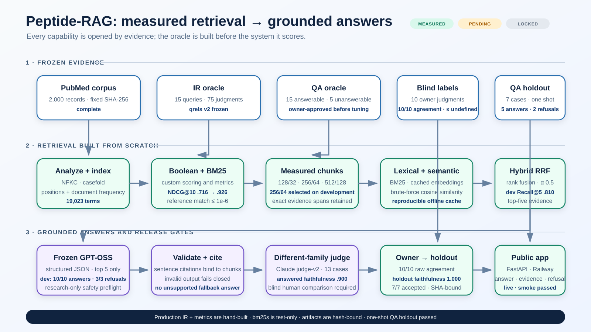

# Peptide-RAG



Peptide-RAG is a research-oriented search and grounded-answer engine for therapeutic-peptide literature. It searches a frozen 2,000-record PubMed corpus with retrieval code written from scratch, then answers from retrieved abstracts with visible citations and explicit refusals when the evidence is insufficient.

The project follows a **measured, not vibed** rule: relevance judgments are frozen before tuning, every retrieval change is evaluated against versioned evidence, and production configuration must match the configuration that passed evaluation.

[Open the hosted app](https://peptide-rag-production.up.railway.app) · [Read the architecture](ARCHITECTURE.md) · [Review the evaluation](SELF-EVALUATION.md)

> **Research use only.** Peptide-RAG summarizes literature; it does not provide medical advice, diagnose conditions, or recommend treatment or dosing.

## What it does

- Searches titles and abstracts with deterministic Boolean retrieval or a hand-built Lucene-style BM25 implementation.
- Supports semantic and hybrid retrieval over frozen, hash-bound chunks when the measured embedding cache is configured.
- Generates evidence-bound answers with PMID citations using the accepted model configuration.
- Refuses personalized dosing requests and fails closed when evidence, provider access, or budget is unavailable.
- Exposes the same capabilities through a small web app, a command-line search tool, and a JSON API.
- Replays the full saved evaluation offline, including corpus, judgment, retrieval, generator, judge, and holdout integrity checks.

No prebuilt information-retrieval library is used by the production index, ranker, or metrics code. `bm25s` is an optional development dependency used only as a differential test oracle.

## Quick start

Requires Python 3.11 or newer.

```bash
git clone https://github.com/goespy/Peptide-RAG.git
cd Peptide-RAG
python -m venv .venv
```

Activate the environment:

```bash
# macOS / Linux
source .venv/bin/activate

# Windows PowerShell
.\.venv\Scripts\Activate.ps1
```

Install and launch:

```bash
python -m pip install -r requirements.txt
python -m uvicorn app:app --host 127.0.0.1 --port 8000
```

Open [http://127.0.0.1:8000](http://127.0.0.1:8000). Local Boolean and BM25 search work without provider credentials.

### Optional semantic search and grounded answers

Copy `.env.example` into your preferred local environment configuration and set:

```text
OPENROUTER_API_KEY=your_server_side_key
EMBEDDING_CACHE_PATH=artifacts/section5/embeddings_256_64.npz
```

The API key must remain server-side. A missing or mismatched cache disables semantic/hybrid retrieval instead of silently rebuilding or changing the measured configuration. Missing generation prerequisites leave retrieval available and return a controlled refusal.

## Use it

### Command line

```bash
python search.py "tesamorelin HIV visceral adipose tissue" --mode bm25 --top-k 5
python search.py "MOTS c AND insulin resistance" --mode boolean --top-k 10
```

Boolean queries support whitespace-delimited `AND` and `OR` plus implicit `AND`; `AND` binds more tightly than `OR`.

### HTTP API

| Method | Endpoint | Purpose |
|---|---|---|
| `GET` | `/healthz` | Service health |
| `GET` | `/api/examples` | Corpus-bound example questions |
| `GET` | `/api/metrics` | Saved evaluation summary |
| `POST` | `/api/search` | Boolean, BM25, semantic, or hybrid retrieval |
| `POST` | `/api/answer` | Evidence-grounded answer or explicit refusal |

Search request:

```bash
curl -X POST http://127.0.0.1:8000/api/search \
  -H "Content-Type: application/json" \
  -d '{"query":"BPC-157 tissue repair","mode":"bm25","k":5}'
```

Grounded-answer request:

```bash
curl -X POST http://127.0.0.1:8000/api/answer \
  -H "Content-Type: application/json" \
  -d '{"query":"What outcomes were reported for tesamorelin in HIV-associated lipodystrophy?","mode":"hybrid","k":5}'
```

Search responses report both the requested and actual retrieval mode, so a visible BM25 fallback is distinguishable from a semantic result.

## How it works

```text
PubMed E-utilities
        |
        v
frozen JSONL corpus -----> shared analyzer -----> positional inverted index
                                                     |            |
                                                     v            v
                                                  Boolean        BM25
                                                     \            /
                                                      \          /
frozen chunks + embeddings --------------------------> hybrid retrieval
                                                               |
                                                               v
                                                grounded generation
                                                               |
                                                               v
                                                answer + PMID evidence
```

The core index stores document frequencies, term frequencies, and token positions in ordinary Python data structures. Retrieval and evaluation are deterministic. Semantic retrieval is opt-in and accepts only artifacts bound to the active corpus and frozen configuration by SHA-256. Answer generation is independently gated by the accepted prompt, model settings, retrieval configuration, and passing holdout artifacts.

See [ARCHITECTURE.md](ARCHITECTURE.md) for tokenization, index structures, ranking formulas, artifact contracts, and failure behavior.

## Evaluation snapshot

These results are compact signposts, not claims of clinical validity. The evaluation sets are intentionally small; denominators and complete artifacts are preserved in the linked reports.

| Layer | Evaluation set | Selected result |
|---|---|---|
| Tuned BM25 | 15 pooled lexical queries | Recall@10 `0.957`; NDCG@10 `0.926` |
| Hybrid retrieval | 10 answerable development questions | Recall@5 `0.810`; Evidence Hit@5 `0.900` |
| Grounded QA | Untouched 7-question holdout | 5/5 answerable answered; 2/2 unanswerable refused; 7/7 structurally valid |

The accepted answer configuration is `openai/gpt-oss-20b`, evaluated by `anthropic/claude-sonnet-4.6` after a separate blind owner-validation step. On the seven-case holdout, faithfulness, relevancy, citation correctness, correct-answer rate, and correct-refusal rate each measured `1.0`. Treat those values in the context of the small frozen sample, not as general performance guarantees.

Full methodology, negative results, costs, denominators, and limitations:

- [SELF-EVALUATION.md](SELF-EVALUATION.md) — capability evidence and release gates
- [ARCHITECTURE.md](ARCHITECTURE.md) — system design and evaluation contracts
- [COST-REPORT.md](COST-REPORT.md) — provider and hosting measurements
- [AI-LOG.md](AI-LOG.md) — concise AI-assisted development record
- [AI-LOG-DETAIL.md](AI-LOG-DETAIL.md) — chronological implementation and review history

## Reproduce the evidence

Run the complete network-free release check:

```bash
python run_project.py
```

It validates the frozen hashes, rebuilds the lexical index, recomputes Boolean/BM25 metrics, and replays the committed RAG evaluation artifacts. Any required mismatch exits nonzero.

Run the test suite:

```bash
python -m unittest discover -s tests -v
```

Install `requirements-dev.txt` first to include the optional reference-BM25 differential test:

```bash
python -m pip install -r requirements-dev.txt
python -m unittest discover -s tests -v
```

## Rebuild the PubMed corpus

The checked-in corpus is the reproducible project snapshot. To create a new snapshot with the frozen peptide query:

```bash
python scripts/fetch_pubmed.py --email you@example.com --overwrite
```

The fetcher uses NCBI ESearch and batched EFetch requests, waits at least 0.34 seconds between calls, and writes `data/corpus.jsonl` only after a successful parse. Set `NCBI_EMAIL` instead of passing `--email`; `NCBI_API_KEY` is optional.

A rebuilt corpus has a new identity. Existing qrels, chunks, embeddings, metrics, and release evidence must not be presented as valid for it until they are regenerated and reviewed.

## Repository guide

| Path | Contents |
|---|---|
| `src/` | Analyzer, index, Boolean/BM25/hybrid retrieval, metrics, generation, and service code |
| `scripts/` | Corpus, qrels, chunking, evaluation, holdout, and deployment utilities |
| `data/` | Frozen corpus, judgments, QA oracle, and saved model outputs |
| `artifacts/` | Versioned evaluation reports, manifests, caches, and release evidence |
| `tests/` | Unit, differential, integration, integrity, and service tests |
| `static/` | Browser interface |

For deployment configuration and operational limits, see [DEPLOYMENT.md](DEPLOYMENT.md). Earlier planning decisions are retained in [Presearch.md](Presearch.md), [Post-Stack Refinement.md](Post-Stack%20Refinement.md), and [Project-Master-Plan.md](Project-Master-Plan.md).

## Data, safety, and limitations

- PubMed abstracts are literature records, not clinical recommendations or proof of efficacy.
- Corpus coverage is limited to the frozen query and snapshot; it is neither exhaustive nor continuously updated.
- Relevance judgments, QA cases, and holdouts are small, purpose-built evaluation sets.
- Semantic retrieval and grounded generation depend on hosted model availability and configured budgets; lexical retrieval remains local.
- The service uses single-process rate and budget counters, not distributed controls.
- NCBI does not endorse this project. Abstracts may contain copyrighted material; see [DATA-NOTICE.md](DATA-NOTICE.md) and the [NCBI disclaimer and copyright notice](https://www.ncbi.nlm.nih.gov/home/about/policies/).

## License

The original software is available under the [MIT License](LICENSE). That license does not grant rights to third-party PubMed or publisher content.

